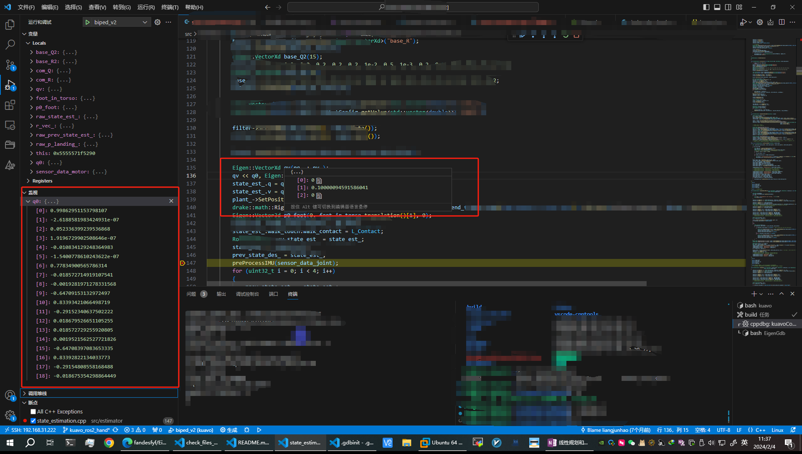

# EigenGdb
用于vscode中debug直接显示eigen变量的配置

# 用法

克隆仓库,执行`setup.sh`脚本,然后在vscode中重新debug即可。
```shell
git clone git@github.com:fandesfyf/EigenGdb.git
cd EigenGdb
./setup.sh

```

# 效果

鼠标悬浮和监视台都会直接显示变量的值。

